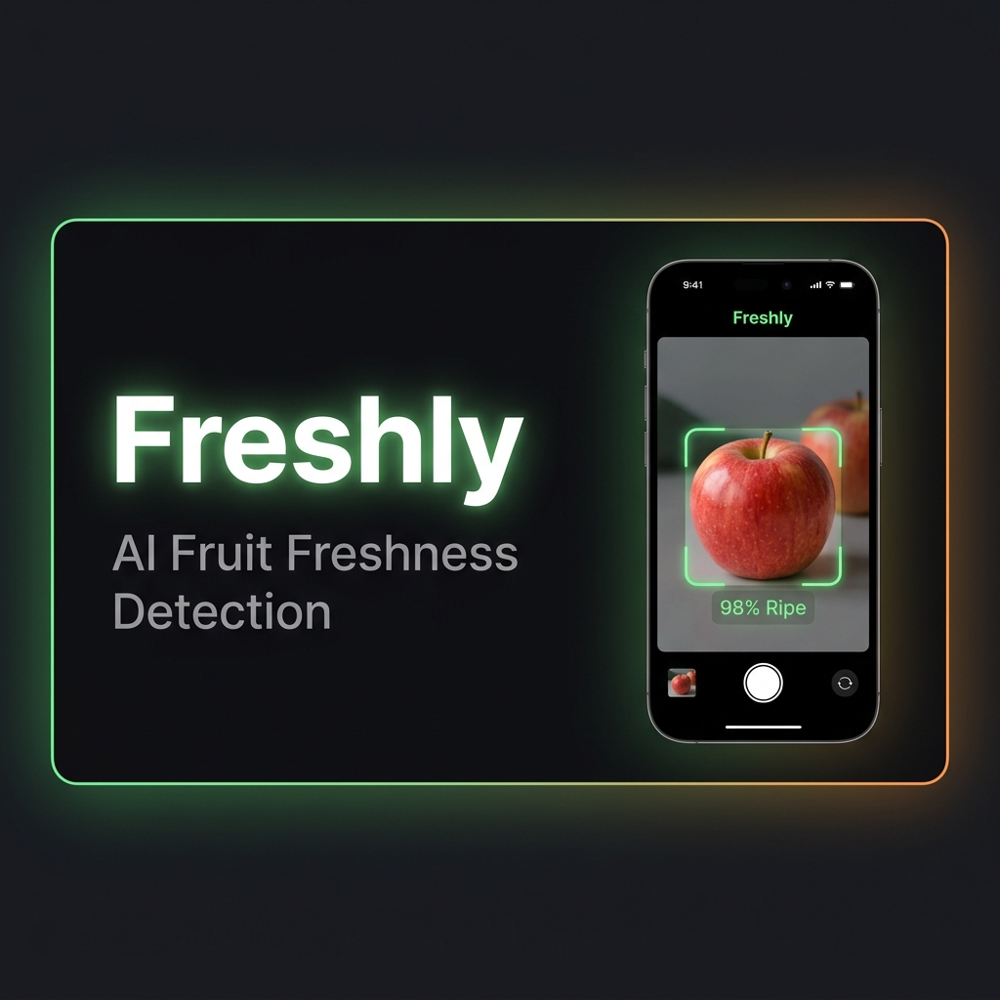
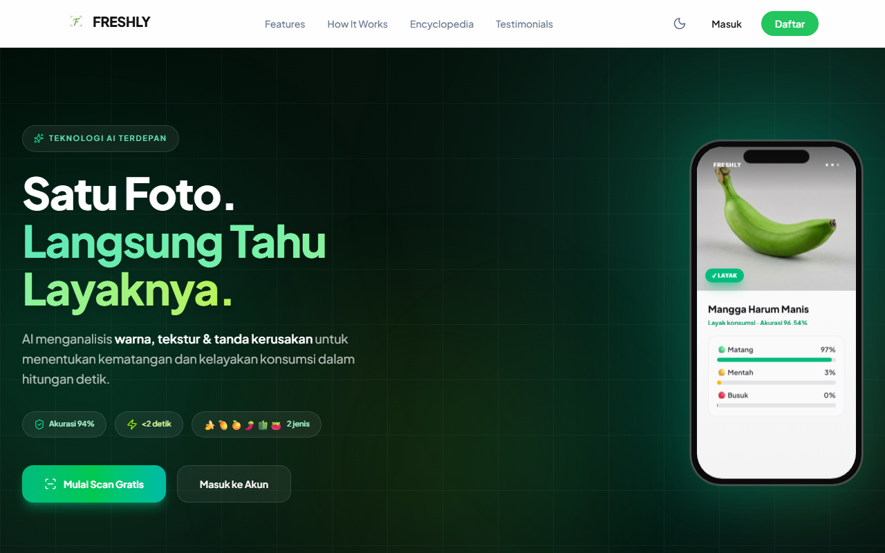
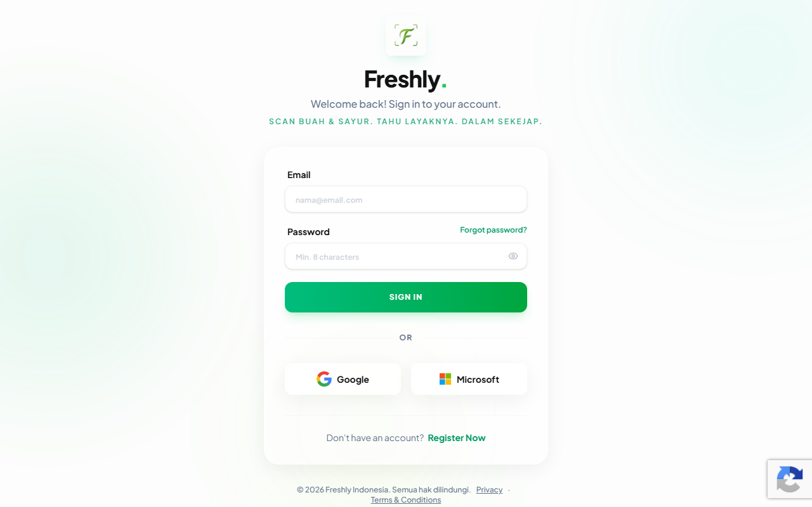
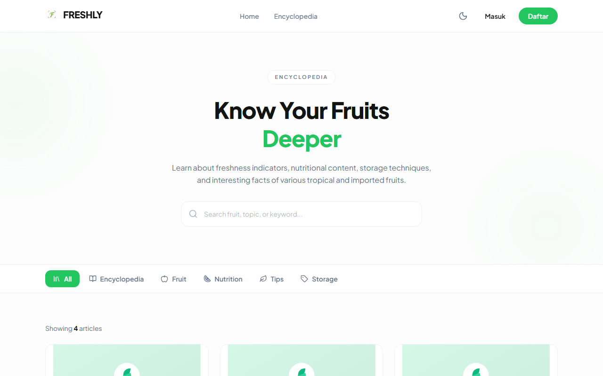
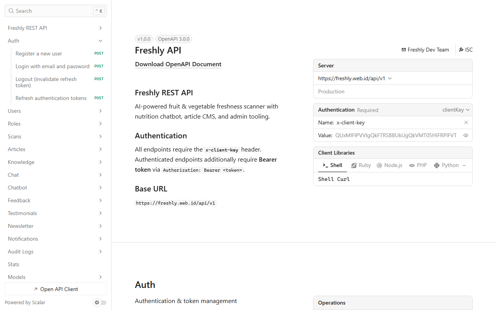
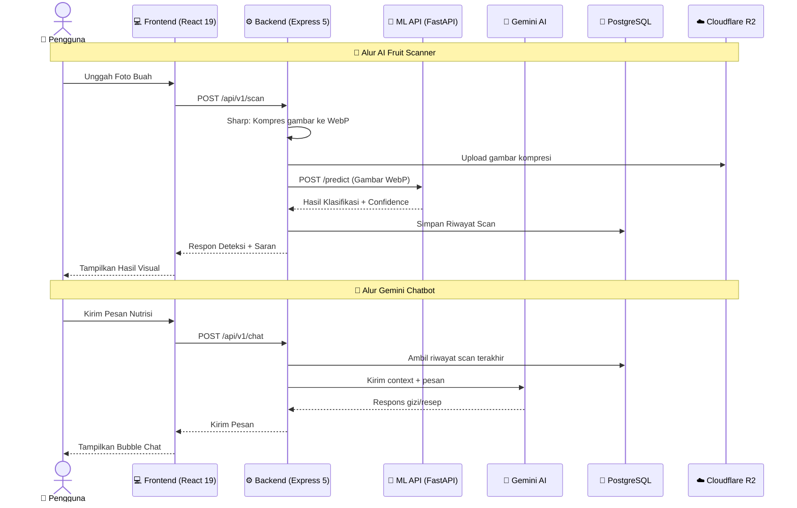
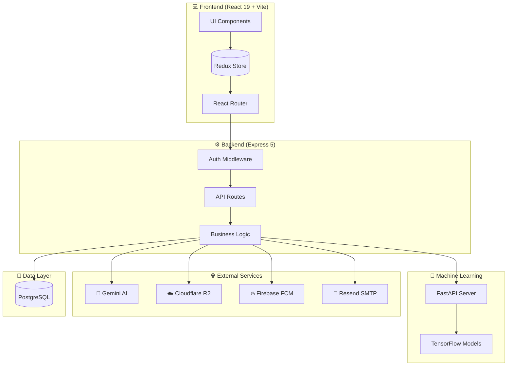

<!-- PROJECT BANNER -->
<p align="center">
  <a href="https://freshly.web.id/" target="_blank">
    
  </a>
</p>

<!-- PROJECT HEADER -->
<div align="center">
  <h1>🍏 Freshly — AI Fruit Freshness Detection</h1>
  <p>
    <b>Platform cerdas berbasis Computer Vision &amp; Kecerdasan Buatan untuk klasifikasi kematangan buah secara instan.</b>
  </p>

  <!-- LIVE DEMO + QUICK LINKS -->
  <p align="center">
    <a href="https://freshly.web.id/" target="_blank">
      
    </a>
    <a href="https://dashboard-freshly-capstone.streamlit.app/" target="_blank">
      
    </a>
    <a href="User%20Guide%20FRESHLY.pdf">
      
    </a>
    <a href="LICENSE">
      
    </a>
  </p>

  <!-- Table of Contents / Quick Navigation -->
  <p align="center">
    <a href="#-preview">Preview</a> •
    <a href="#-tentang-freshly">Tentang</a> •
    <a href="#-fitur-utama">Fitur</a> •
    <a href="#-arsitektur-sistem">Arsitektur</a> •
    <a href="#-spesifikasi-teknologi">Tech Stack</a> •
    <a href="#-model-machine-learning">Model ML</a> •
    <a href="#-api-endpoints-reference">API</a> •
    <a href="#-panduan-instalasi">Instalasi</a> •
    <a href="#-faq">FAQ</a> •
    <a href="#-roadmap">Roadmap</a>
  </p>

  <!-- BADGES -->
  <p align="center">
    
    
    
    
    
    
    
    
    
  </p>

  <p align="center">
    
    
    
    
  </p>

  <!-- GIVE A STAR CTA -->
  <p>
    <i>Star ⭐ repo ini kalau kamu suka projectnya!</i>
  </p>
</div>

<br />

---

## 📱 Preview

> *Klik gambar untuk melihat versi penuh*

<table>
<tr>
<td width="50%" align="center">

**🏠 Halaman Utama (Homepage)**
<br/>
<a href="fullstack/frontend/src/assets/images/screenshots/home.png" target="_blank">
  
</a>

</td>
<td width="50%" align="center">

**🔑 Halaman Masuk (Login)**
<br/>
<a href="fullstack/frontend/src/assets/images/screenshots/login.png" target="_blank">
  
</a>

</td>
</tr>
<tr>
<td align="center">

**📚 Ensiklopedia Buah (Encyclopedia)**
<br/>
<a href="fullstack/frontend/src/assets/images/screenshots/ensiklopedia.png" target="_blank">
  
</a>

</td>
<td align="center">

**📄 Dokumentasi API (Swagger Docs)**
<br/>
<a href="fullstack/frontend/src/assets/images/screenshots/api_docs.png" target="_blank">
  
</a>

</td>
</tr>
</table>

---

## 📖 Tentang Freshly

**Freshly** adalah solusi *all-in-one* modern berkinerja tinggi yang menggabungkan kecanggihan algoritma Deep Learning dan kemudahan penggunaan aplikasi web. Dirancang menggunakan arsitektur monorepo terpadu, platform ini membantu pengguna akhir maupun pemilik bisnis buah-buahan untuk menentukan kualitas kesegaran buah secara objektif dan mendapatkan saran gizi kontekstual secara langsung.

> [!NOTE]
> Freshly dibangun dengan arsitektur **monorepo** yang terintegrasi penuh: **Frontend** (React 19 + Vite + Tailwind v4), **Backend** (Express 5 + PostgreSQL), **Machine Learning API** (FastAPI + TensorFlow), dan **Cloud Infrastructure** (Vercel + Cloudflare R2 + Firebase).

**🌐 Live App**: [freshly.web.id](https://freshly.web.id/) · **📊 Live Dashboard**: [dashboard-freshly-capstone.streamlit.app](https://dashboard-freshly-capstone.streamlit.app/).

---

## 📚 Panduan Pengguna (User Guide)

Untuk memahami seluruh alur sistem, panduan pengoperasian aplikasi, serta deskripsi fungsionalitas secara lengkap dan visual bagi administrator maupun pengguna akhir, silakan merujuk ke dokumen PDF resmi:

<p align="center">
  <a href="User%20Guide%20FRESHLY.pdf">
    
  </a>
</p>

---

## 📌 Project Status

<table>
<tr>
<td width="33%" align="center">

**✅ Project Status**
<br/>

<br/>
<sub>Production Ready</sub>


**📅 Last Updated**
<br/>

<br/>
<sub>v1.0.0</sub>

</td>
</tr>
</table>

**Freshly telah mencapai tahap finalisasi dan siap untuk deployment production. Semua fitur utama telah diimplementasikan, diuji, dan didokumentasikan dengan lengkap. Project ini akan terus dimonitor dan dimaintain untuk bug fixes serta feature enhancements.**

---

## 🌟 Fitur Utama

<table>
<tr>
<td width="50%">

### 📷 AI Fruit Scanner
- Klasifikasi tingkat kematangan buah (*Matang*, *Belum Matang*, *Busuk*)
- **Confidence score** & saran kelayakan konsumsi instan
- Kompresi gambar pintar berbasis **WebP** via Sharp
- Penyimpanan aset di **Cloudflare R2** Object Storage

</td>
<td width="50%">

### 💬 Gemini AI Chatbot
- Asisten virtual nutrisi interaktif berbasis **Google Gemini**
- *Context-awareness* — memahami hasil scan buah terakhir
- Dukungan **Markdown rendering** & syntax highlighting
- Riwayat obrolan tersimpan di database

</td>
</tr>
<tr>
<td>

### 📚 Fruit Encyclopedia
- Katalog visual buah-buahan komprehensif
- Informasi kalori, vitamin, kandungan gizi lengkap
- Tips memilih buah manis secara tradisional
- Pencarian & filter berdasarkan kategori

</td>
<td>

### 👑 Admin Portal & CMS
- Manajemen akun pengguna & tinjauan testimonial
- Audit logs sistem untuk aktivitas operasional
- Editor WYSIWYG **TipTap** untuk artikel edukasi
- Dashboard statistik real-time

</td>
</tr>
</table>

---

## 🔄 Arsitektur Sistem

Diagram berikut menunjukkan alur komunikasi penuh antara Frontend, Backend, Model Machine Learning, dan layanan eksternal:



### 🏗️ High-Level Architecture



---

## 🗂️ Monorepo Structure

```
FRESHLY/
├── 🧠 ai/                          # Machine Learning Pipeline
│   ├── freshly_api/                # FastAPI model serving endpoint
│   │   ├── main.py                 # API entry point
│   │   ├── requirements.txt        # Python dependencies
│   │   ├── Dockerfile              # Container config
│   │   ├── *_saved_model/          # TF SavedModel (6 buah)
│   │   └── ...
│   ├── freshly_model/              # Training notebooks
│   │   ├── banana_model.ipynb
│   │   ├── mango_model.ipynb
│   │   ├── tomato_model.ipynb
│   │   └── ...
│   ├── model_h5/                   # Keras .h5 models
│   ├── saved_model/                # TF SavedModel exports
│   └── logs/                       # TensorBoard logs
│
├── 📊 data-science/                # Data Pipeline & Analytics
│   ├── dashboard/                  # Streamlit dashboard
│   ├── datasets/                   # Dataset docs & summaries
│   ├── notebooks/                  # Data processing pipelines
│   ├── scraping/                   # Image scraping scripts
│   └── docs/                       # Technical reports (PDF)
│
├── 💻 fullstack/                   # Web Application
│   ├── backend/                    # Express.js REST API
│   │   ├── api/                    # Vercel Serverless Entrypoints
│   │   ├── migrations/             # Sequelize DB migrations
│   │   ├── src/
│   │   │   ├── config/             # DB, Firebase, JWT, AI configs
│   │   │   ├── controllers/        # HTTP request handlers
│   │   │   ├── middlewares/        # Security & auth layers
│   │   │   ├── models/             # Sequelize model definitions
│   │   │   ├── routes/             # API v1 route declarations
│   │   │   ├── services/           # Business logic
│   │   │   ├── validations/        # Joi schema validation
│   │   │   └── utils/              # Helpers & error handling
│   │   └── tests/                  # Unit tests (Jest)
│   │
│   └── frontend/                   # React SPA
│       ├── e2e/                    # Playwright E2E tests
│       ├── public/                 # Static assets
│       └── src/
│           ├── api/                # Axios interceptors
│           ├── components/         # Reusable UI components
│           ├── hooks/              # Custom React hooks
│           ├── layouts/            # Page layouts
│           ├── pages/              # 24 route pages
│           ├── redux/              # Redux store & slices
│           ├── router/             # Route definitions
│           ├── i18n/               # Internationalization (ID/EN)
│           └── types/              # TypeScript declarations
│
├── 📄 LICENSE                       # Apache 2.0 License
└── 📄 README.md                     # ← You are here
```

> [!NOTE]
> Masing-masing subfolder di atas (`ai`, `data-science`, dan `fullstack`) memiliki file `README.md` tersendiri dengan instruksi detail mengenai cara setup dan penggunaan modul tersebut.

---

## 🛠️ Spesifikasi Teknologi

<table>
<tr>
<td width="33%">

### 🧠 Machine Learning

| Teknologi | Peran |
| :--- | :--- |
| **TensorFlow/Keras** | Model training & inference |
| **FastAPI** | REST API model serving |
| **Python** | ML pipeline language |
| **Jupyter** | Experiment notebooks |

</td>
<td width="33%">

### 💻 Frontend

| Teknologi | Peran |
| :--- | :--- |
| **React 19** | UI Library + Compiler |
| **TypeScript** | Type safety |
| **Vite** | Build tool & dev server |
| **Tailwind CSS 4** | Utility-first styling |
| **Redux Toolkit** | State management |
| **MUI v9** | Component library |

</td>
<td width="33%">

### ⚙️ Backend

| Teknologi | Peran |
| :--- | :--- |
| **Express 5** | Web framework |
| **Sequelize 6** | PostgreSQL ORM |
| **Sharp** | Image WebP compression |
| **Gemini SDK** | AI chatbot |
| **Cloudflare R2** | Object storage |
| **Firebase FCM** | Push notifications |

</td>
</tr>
</table>

### ☁️ Cloud Infrastructure

| Layanan | Provider | Fungsi |
| :--- | :--- | :--- |
| **Hosting** |  | Frontend & serverless backend |
| **Object Storage** |  | Gambar buah (CDN global) |
| **Database** |  | PostgreSQL managed |
| **AI Service** |  | Chatbot nutrisi LLM |
| **ML Hosting** |  | FastAPI model serving |
| **Push Notification** |  | FCM notifikasi real-time |
| **Email** |  | SMTP email service |

---

## 🧠 Model Machine Learning

Freshly menggunakan arsitektur deep learning kustom yang dilatih secara spesifik untuk klasifikasi tingkat kematangan komoditas buah & sayur berikut:

| No | Komoditas | SavedModel Folder | Daftar Kelas Klasifikasi | Notebook Pelatihan |
|---|---|---|---|---|
| 1 | **Pisang** (Banana) | [banana_saved_model](file:///ai/freshly_api/banana_saved_model) | `banana_ripe`, `banana_rotten`, `banana_unripe` | [banana_model.ipynb](file:///ai/freshly_model/banana_model.ipynb) |
| 2 | **Cabai** (Chili) | [chili_saved_model](file:///ai/freshly_api/chili_saved_model) | `chili_ripe`, `chili_rotten`, `chili_unripe` | [chili_model.ipynb](file:///ai/freshly_model/chili_model.ipynb) |
| 3 | **Mangga** (Mango) | [mango_saved_model](file:///ai/freshly_api/mango_saved_model) | `mango_ripe`, `mango_rotten`, `mango_unripe` | [mango_model.ipynb](file:///ai/freshly_model/mango_model.ipynb) |
| 4 | **Jeruk** (Orange) | [orange_saved_model](file:///ai/freshly_api/orange_saved_model) | `orange_ripe`, `orange_rotten`, `orange_unripe` | [orange_model.ipynb](file:///ai/freshly_model/orange_model.ipynb) |
| 5 | **Paprika** (Paprika) | [paprika_saved_model](file:///ai/freshly_api/paprika_saved_model) | `paprika_ripe`, `paprika_rotten`, `paprika_unripe` | [paprika_model.ipynb](file:///ai/freshly_model/paprika_model.ipynb) |
| 6 | **Tomat** (Tomato) | [tomato_saved_model](file:///ai/freshly_api/tomato_saved_model) | `tomato_ripe`, `tomato_rotten`, `tomato_unripe` | [tomato_model.ipynb](file:///ai/freshly_model/tomato_model.ipynb) |

> [!TIP]
> Semua model menerima input tensor gambar berukuran `(224, 224)` dengan 3 channel warna (RGB) dan preprocessing normalisasi mean-std ImageNet.

---

## 📊 Data Science & Analytics

Modul Data Science pada Freshly bertanggung jawab atas pengumpulan dataset, pembersihan data (*data cleaning*), analisis statistik citra, serta penyajian metrik distribusi melalui dashboard interaktif.

### 🌟 Fitur Utama Modul Data Science
1. **Automated Scraping** ([scrapping_gambar.py](file:///data-science/scraping/scrapping_gambar.py)): Mengotomatisasi pengumpulan gambar dari search engine untuk memperkaya variasi dataset pelatihan.
2. **Data Pipeline & Cleaning** ([01_freshly_data_pipeline.ipynb](file:///data-science/notebooks/01_freshly_data_pipeline.ipynb)): 
   - Deteksi dan eliminasi gambar duplikat serta gambar beresolusi rendah.
   - Analisis ketidakseimbangan kelas (*imbalance ratio*).
   - Perhitungan *Fisher Separability Score* dan *Overlap Score* untuk mengevaluasi kualitas separabilitas fitur warna RGB/HSV antar kelas kematangan.
3. **Streamlit Analytics Dashboard** ([dashboard_freshly.py](file:///data-science/dashboard/dashboard_freshly.py) · 🌐 **[Live Demo](https://dashboard-freshly-capstone.streamlit.app/)**): Visualisasi interaktif hasil analisis data, komposisi kelas, sebaran warna, serta perbandingan metrik sebelum/sesudah data cleaning.
4. **Technical Reporting** ([LAPORAN TEKNIS PROYEK FRESHLY.pdf](file:///data-science/docs/LAPORAN%20TEKNIS%20PROYEK%20FRESHLY.pdf)): Dokumentasi resmi mengenai metodologi analisis data, eksplorasi fitur, dan hasil temuan eksperimen.

### 💻 Cara Menjalankan Dashboard Streamlit
```bash
# 1. Pindah ke direktori dashboard
cd data-science/dashboard

# 2. Pasang dependensi yang diperlukan
pip install -r requirements.txt

# 3. Jalankan dashboard lokal
streamlit run dashboard_freshly.py
```

---

## 🌐 API Endpoints Reference

<details>
<summary><b>🔑 Otentikasi (Authentication)</b></summary>

- `POST /api/v1/auth/register` - Pendaftaran akun baru
- `POST /api/v1/auth/login` - Masuk log & dapatkan JWT + Silent Refresh cookie
- `POST /api/v1/auth/logout` - Keluar log & hapus token aktif
- `POST /api/v1/auth/refresh-token` - Mendapatkan JWT baru menggunakan refresh token

</details>

<details>
<summary><b>📷 Deteksi & Riwayat (Scans)</b></summary>

- `POST /api/v1/scans` - Deteksi kesegaran buah (menerima multipart/form-data: gambar + jenis buah)
- `GET /api/v1/scans` - Mendapatkan daftar riwayat scan pengguna (mendukung paginasi)
- `GET /api/v1/scans/:id` - Melihat detail hasil scan spesifik berdasarkan ID
- `DELETE /api/v1/scans/:id` - Menghapus item riwayat scan spesifik

</details>

<details>
<summary><b>💬 Gemini Chatbot (Asisten Nutrisi)</b></summary>

- `POST /api/v1/chatbot` - Mengirim pesan obrolan interaktif terintegrasi dengan konteks scan buah terbaru
- `GET /api/v1/chatbot/sessions` - Mengambil daftar sesi chat aktif pengguna
- `GET /api/v1/chatbot/sessions/:sessionId` - Mengambil seluruh pesan dalam sesi obrolan tertentu

</details>

<details>
<summary><b>📚 Edukasi & Artikel (Articles & Encyclopedia)</b></summary>

- `GET /api/v1/articles` - Mendapatkan daftar artikel edukasi buah-buahan
- `GET /api/v1/articles/:slug` - Detail artikel berdasarkan slug URL
- `POST /api/v1/articles` *(Admin Only)* - Menambahkan artikel baru (mendukung TipTap WYSIWYG editor)
- `PUT /api/v1/articles/:id` *(Admin Only)* - Memperbarui artikel
- `DELETE /api/v1/articles/:id` *(Admin Only)* - Menghapus artikel

</details>

---

## 🛡️ Keamanan Sistem

<table>
<tr>
<td width="50%">

- 🛡️ **Helmet Security Headers** — Proteksi HTTP headers (CSP tanpa `unsafe-inline`)
- 🚦 **Rate Limiting** — Mencegah brute-force (1000 req/5min global, 10 req/15min auth)
- 🤖 **Google reCAPTCHA v2** — Proteksi spam form
- 🔑 **JWT + Silent Refresh** — Otentikasi tanpa interupsi (dengan refresh queue)

</td>
<td width="50%">

- 🧹 **HTML Sanitizer** — Pencegahan XSS
- 🔒 **Client Key Handshake** — Validasi frontend-backend
- 📋 **Joi Schema Validation** — Input sanitization
- 📊 **Audit Logging** — Pelacakan aktivitas sistem
- 🚫 **Token Blacklist** — Refresh token di-revoke saat logout

</td>
</tr>
</table>

---

## 🚀 Panduan Instalasi

### Persyaratan Sistem

| Software | Versi Minimum | Verifikasi |
| :--- | :--- | :--- |
| **Node.js** | v18.x+ | `node --version` |
| **NPM** | v9.x+ | `npm --version` |
| **PostgreSQL** | v14+ | `psql --version` |
| **Python** | v3.10+ | `python --version` |

### 💻 Quick Start

```bash
# 1. Clone repository
git clone https://github.com/FRESHLY-CC26-PSU059/FRESHLY.git
cd FRESHLY

# 2. Setup Backend
cd fullstack/backend
cp .env.example .env        # Konfigurasi environment
npm install                  # Pasang dependensi
npm run migrate              # Jalankan migrasi DB
npm run seed:admin           # Buat akun admin default
npm run dev                  # Jalankan server (port 5000)

# 3. Setup Frontend (terminal baru)
cd ../frontend
cp .env.example .env        # Konfigurasi environment
npm install                  # Pasang dependensi
npm run dev                  # Jalankan dev server (port 5173)

# 4. Setup ML API (opsional, terminal baru)
cd ../../ai/freshly_api
pip install -r requirements.txt
python main.py               # Jalankan FastAPI (port 8000)
```

Akses aplikasi: **[http://localhost:5173](http://localhost:5173)**

---

## ☁️ Deployment

<details>
<summary><b>🔧 Backend Environment Variables</b></summary>

```env
# SERVER & CORS
NODE_ENV=production
PORT=5000
CORS_ORIGIN=https://freshly.web.id
FRONTEND_URL=https://freshly.web.id
CLIENT_KEY=your_frontend_api_handshake_key

# JWT SECURITY TOKENS
JWT_SECRET=your_jwt_secret_key
JWT_REFRESH_SECRET=your_jwt_refresh_secret_key
JWT_EXPIRES_IN=1d
JWT_REFRESH_EXPIRES_IN=30d

# SUPABASE / POSTGRES DATABASE
PG_HOST=your_supabase_pooler_host
PG_PORT=5432
PG_DATABASE=postgres
PG_USER=postgres
PG_PASSWORD=your_secure_password

# CLOUDFLARE R2 OBJECT STORAGE
R2_ACCOUNT_ID=your_cloudflare_r2_account_id
R2_BUCKET_NAME=your_r2_bucket_name
R2_ACCESS_KEY_ID=your_r2_access_key_id
R2_SECRET_ACCESS_KEY=your_r2_secret_access_key
R2_PUBLIC_URL=https://your_r2_public_url.r2.dev

# GOOGLE GEMINI AI
GEMINI_API_KEY=your_google_gemini_api_key

# MACHINE LEARNING API
ML_API_URL=https://your_ml_model_api_url.space
ML_API_TIMEOUT=30000
ML_API_MOCK=false

# GOOGLE RECAPTCHA v2
RECAPTCHA_SECRET_KEY=your_recaptcha_secret_key

# SMTP EMAIL SERVICE (Resend)
SMTP_HOST=smtp.resend.com
SMTP_PORT=465
SMTP_USER=resend
SMTP_PASS=your_resend_smtp_password
SMTP_FROM=noreply@freshly.web.id
```

</details>

<details>
<summary><b>🔧 Frontend Environment Variables</b></summary>

```env
# RESTful API Backend
VITE_API_URL=https://freshly.web.id/api/v1

# Client Key Handshake
VITE_CLIENT_KEY=your_frontend_api_handshake_key_here

# Google reCAPTCHA v2 (Site Key)
VITE_RECAPTCHA_SITE_KEY=your_recaptcha_site_key_here

# Firebase Web App (FCM Push Notifications)
VITE_FIREBASE_API_KEY=your_firebase_web_api_key_here
VITE_FIREBASE_APP_ID=your_firebase_web_app_id_here
VITE_FIREBASE_AUTH_DOMAIN=your_firebase_project_id.firebaseapp.com
VITE_FIREBASE_MEASUREMENT_ID=your_firebase_measurement_id_here
VITE_FIREBASE_MESSAGING_SENDER_ID=your_firebase_messaging_sender_id_here
VITE_FIREBASE_PROJECT_ID=your_firebase_project_id_here
VITE_FIREBASE_STORAGE_BUCKET=your_firebase_project_id.firebasestorage.app
VITE_FIREBASE_VAPID_KEY=your_firebase_fcm_vapid_key_here

# Contact
VITE_CONTACT_EMAIL=support@freshly.web.id,info@freshly.web.id
```

</details>

---

## 🧪 Testing

```bash
# Backend - Unit Tests (Jest)
cd fullstack/backend
npm run test
npm run test:coverage

# Backend - API Integration (Newman/Postman)
npm run test:api

# Frontend - Unit & Component Tests (Vitest)
cd ../frontend
npm run test:unit
npm run test:coverage

# Frontend - E2E Tests (Playwright)
npm run test:e2e:ui

# ML Model - Training
cd ../../ai/freshly_model
jupyter notebook              # Buka training notebooks
```

---

## ❓ FAQ

<details>
<summary><b>Berbapa jenis buah yang didukung Freshly?</b></summary>

Freshly mendukung **6 jenis buah/sayur**: Pisang, Cabai, Mangga, Jeruk, Paprika, dan Tomat. Masing-masing memiliki model khusus untuk klasifikasi kematangan (Matang, Belum Matang, Busuk).

</details>

<details>
<summary><b>Apakah Freshly bisa digunakan tanpa internet?</b></summary>

Tidak. Freshly membutuhkan koneksi internet karena:
- Model ML di-host di **Railway** (cloud)
- Chatbot menggunakan **Google Gemini API**
- Gambar disimpan di **Cloudflare R2**

</details>

<details>
<summary><b>Bagaimana cara menambah jenis buah baru?</b></summary>

1. Siapkan dataset gambar buah dengan 3 kelas: `ripe`, `rotten`, `unripe`
2. Buat notebook training baru di `ai/freshly_model/`
3. Export model ke format TensorFlow SavedModel
4. Deploy model baru ke FastAPI server
5. Update mapping di backend service

</details>

<details>
<summary><b>Apakah ada rate limit untuk API?</b></summary>

Ya. Rate limit yang diterapkan:
- **Global**: 1000 requests / 5 menit
- **Auth endpoints**: 10 requests / 15 menit (anti brute-force)

</details>

---

## 🗺️ Roadmap

Lihat [Projects](https://github.com/FRESHLY-CC26-PSU059/FRESHLY/projects) untuk detail issues dan progress.

- [x] ✅ AI Fruit Scanner — Klasifikasi 6 jenis buah
- [x] ✅ Gemini Chatbot — Asisten nutrisi context-aware
- [x] ✅ Fruit Encyclopedia — Katalog buah + info gizi
- [x] ✅ Admin Portal — CMS + Dashboard
- [x] ✅ Authentication — JWT + Silent Refresh
- [x] ✅ Push Notification — Firebase FCM
- [ ] 🔄 Add More Fruit and Vegetable Commodities
- [ ] 🔄 Mobile App

---

## 👥 Kontribusi

Kontribusi sangat diapresiasi! Silakan buka [Issues](https://github.com/FRESHLY-CC26-PSU059/FRESHLY/issues) atau kirim Pull Request.

```
1. Fork repo ini
2. Buat branch baru: git checkout -b feature/fitur-baru
3. Commit perubahan: git commit -m 'feat: tambah fitur X'
4. Push ke branch: git push origin feature/fitur-baru
5. Buka Pull Request
```

---

## 📄 Lisensi

Hak Cipta dilindungi di bawah **Apache License 2.0** — Bebas digunakan, dimodifikasi, dan didistribusikan untuk kepentingan akademis, pembelajaran, dan riset mandiri.

Lihat file [LICENSE](LICENSE) untuk informasi lebih lanjut.

---

## ⭐ Star History

<a href="https://star-history.com/#FRESHLY-CC26-PSU059/FRESHLY&Date">
 <picture>
   <source media="(prefers-color-scheme: dark)" srcset="https://api.star-history.com/svg?repos=FRESHLY-CC26-PSU059/FRESHLY&type=Date&theme=dark" />
   <source media="(prefers-color-scheme: light)" srcset="https://api.star-history.com/svg?repos=FRESHLY-CC26-PSU059/FRESHLY&type=Date" />
   
 </picture>
</a>

---

<p align="center">
  <a href="#-freshly--ai-fruit-freshness-detection"><b>⬆️ Kembali ke Atas</b></a>
</p>
