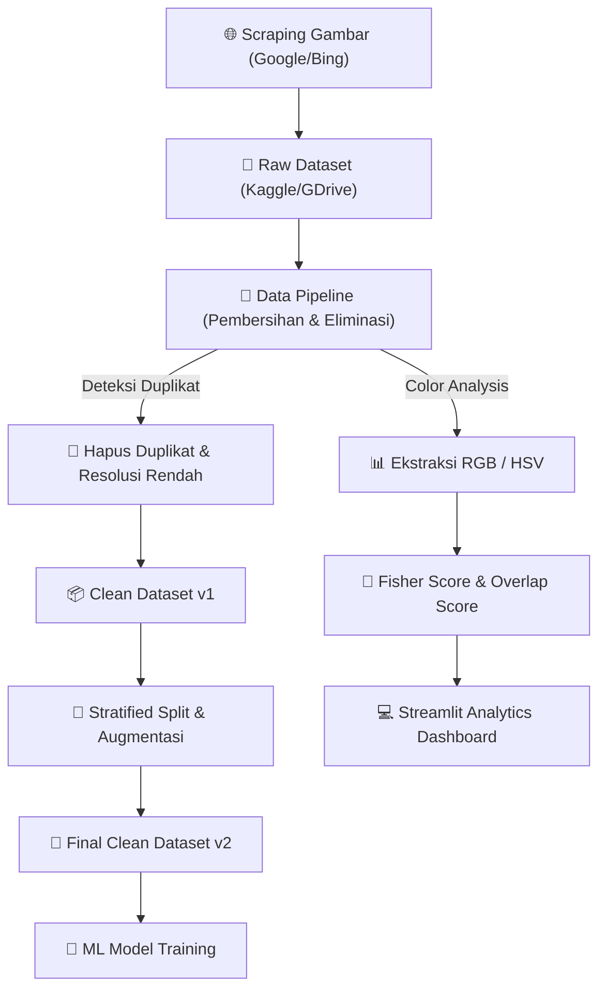

<div align="center">
  <h1>📊 FRESHLY Data Science & Analytics Module</h1>
  <p>
    <b>Pipeline Pengolahan Data, Pembersihan Dataset, Analisis Fitur Visual, dan Dashboard Analisis Interaktif.</b>
  </p>

  <p align="center">
    <a href="https://dashboard-freshly-capstone.streamlit.app/" target="_blank">
      
    </a>
    <a href="docs/LAPORAN%20TEKNIS%20PROYEK%20FRESHLY.pdf">
      
    </a>
    
  </p>

  <p align="center">
    
    
    
    
    
    
  </p>
</div>

---

## 📖 Deskripsi Singkat Modul

Modul **Data Science & Analytics** pada platform **Freshly** bertanggung jawab atas seluruh siklus hidup data (*Data Lifecycle*) sebelum dikonsumsi oleh tim Machine Learning untuk pelatihan model. 

Kami membangun pipeline pengolahan data yang ketat mulai dari **Scraping Citra**, **Pembersihan Data Otomatis (Data Cleaning)** seperti eliminasi duplikat & gambar buram, **Analisis Distribusi Warna** (HSV & RGB), penghitungan **Fisher Separability Score** untuk mengevaluasi kelayakan klasifikasi gambar, hingga penyajian visualisasi metrik secara interaktif melalui dashboard berbasis **Streamlit**.

---

## 🏗️ Alur Pipeline Data Science



---

## 🗂️ Struktur Direktori Modul

```
data-science/
├── 📊 dashboard/                # File dashboard Streamlit & CSV Olahan
│   ├── dashboard_freshly.py     # Kode utama aplikasi dashboard
│   ├── requirements.txt         # Dependensi library untuk dashboard
│   └── *.csv                    # Dataset statistika hasil olahan pipeline
│
├── 📂 datasets/                 # Dokumentasi & Metadata Dataset
│   ├── README.md                # Panduan data sources & mirror Kaggle
│   ├── data_dictionary.csv      # Kamus data kolom dataset
│   └── dataset_summary.csv      # Ringkasan jumlah dataset per kelas
│
├── 📘 docs/                     # Laporan Teknis Proyek (PDF)
│   └── LAPORAN TEKNIS PROYEK FRESHLY.pdf
│
├── 📓 notebooks/                # Notebook Data Pipeline utama
│   └── 01_freshly_data_pipeline.ipynb
│
└── 🕷️ scraping/                 # Skrip pengumpulan data otomatis
    └── scrapping_gambar.py      # Skrip Python untuk Google Image scraping
```

---

## 🌟 Fitur Utama Modul Data Science

### 1. Automated Image Scraping ([scrapping_gambar.py](file:///data-science/scraping/scrapping_gambar.py))
Skrip ini dikembangkan untuk memperkaya variasi citra dataset secara otomatis menggunakan modul scraping web. Skrip mengunduh gambar berdasarkan kata kunci buah/sayur spesifik, menghindari duplikasi tautan unduhan, dan menyimpannya secara rapi terstruktur dalam folder kelas kematangan masing-masing.

### 2. Advanced Data Preprocessing & Cleaning ([01_freshly_data_pipeline.ipynb](file:///data-science/notebooks/01_freshly_data_pipeline.ipynb))
Pipeline pengolahan data utama kami melakukan eliminasi data kotor dengan metode berikut:
* **Deteksi Duplikat (Hash Matching):** Menghapus gambar duplikat berdasarkan pencocokan nilai hash MD5/SHA256 untuk mencegah *data leakage* antar set training dan testing.
* **Penyaringan Resolusi:** Mengeliminasi gambar berukuran di bawah 50x50 piksel atau aspek rasio ekstrim yang tidak layak dilatih.
* **Fisher Separability & Overlap Analysis:** Mengukur separabilitas kelas buah (*Ripe*, *Unripe*, *Rotten*) menggunakan nilai matematika untuk melihat tingkat tumpang tindih fitur warna HSV/RGB sebelum model ML dilatih.

### 3. Streamlit Analytics Dashboard ([dashboard_freshly.py](file:///data-science/dashboard/dashboard_freshly.py))
Aplikasi web interaktif untuk memantau status kesehatan dataset. Fitur-fitur dashboard meliputi:
* **Class Composition:** Visualisasi persentase distribusi data per komoditas dan kelas kematangan.
* **Dataset Cleaning Metrics:** Perbandingan detail jumlah gambar sebelum vs setelah pembersihan, serta statistik gambar duplikat yang tereliminasi.
* **Color Distribution Analysis:** Grafik density plot sebaran warna Hue, Saturation, Value, Red, Green, dan Blue per kelas kematangan.
* **Interactive Feature Scatter Plot:** Scatter plot 3D/2D untuk mendeteksi *overlap* fitur warna antar kelas.

---

## 📦 Informasi Sumber Data (Datasets)

Semua repositori data dikelola secara transparan dan dicerminkan pada tautan publik berikut:
* **Raw Dataset (Google Drive):** [Buka Google Drive](https://drive.google.com/drive/folders/1OKRIno5x2jUVYfLaSTwYssvhDqt5naaG?usp=sharing)
* **Raw Dataset (Kaggle Mirror):** [Kaggle - Capstone Raw Dataset](https://www.kaggle.com/datasets/araazh/capstone-raw-dataset)
* **Clean Dataset v1 (Kaggle):** [Kaggle - Capstone Clean Dataset](https://www.kaggle.com/datasets/araazh/capstone-clean-dataset)
* **Clean Dataset v2 (Final ML Ready):** [Kaggle - Capstone Clean Dataset v2](https://www.kaggle.com/datasets/araazh/capstone-clean-dataset-v2)

---

## 🚀 Petunjuk Setup & Cara Menjalankan Dashboard

Ikuti langkah-langkah di bawah ini untuk menjalankan dashboard analitik Streamlit secara lokal:

### 1. Persiapan Environment & Dependensi
Pastikan komputer Anda sudah terpasang **Python 3.10+** (disarankan menggunakan virtual environment).

```bash
# 1. Pindah ke direktori dashboard
cd data-science/dashboard

# 2. Buat virtual environment
python -m venv ds-env

# 3. Aktifkan virtual environment
# Windows:
ds-env\Scripts\activate
# Mac/Linux:
source ds-env/bin/activate

# 4. Pasang library dependensi
pip install --upgrade pip
pip install -r requirements.txt
```

### 2. Menjalankan Dashboard Streamlit
Jalankan perintah berikut pada terminal yang aktif virtual environment-nya:
```bash
streamlit run dashboard_freshly.py
```
Aplikasi secara otomatis akan terbuka pada peramban web default Anda di alamat **`http://localhost:8501`**.

---

## 📘 Laporan Teknis Proyek
Untuk membaca penjelasan akademis dan detail teoritis mengenai pengujian statistik warna, metrik evaluasi separabilitas, serta proses augmentasi data yang diterapkan pada dataset Freshly, silakan baca berkas PDF resmi kami di:
👉 **[Laporan Teknis Proyek Freshly (PDF)](file:///data-science/docs/LAPORAN%20TEKNIS%20PROYEK%20FRESHLY.pdf)**

---
**Developed with 💚📊 by Tim Data Science FRESHLY - Coding Camp powered by DBS Foundation 2026**
