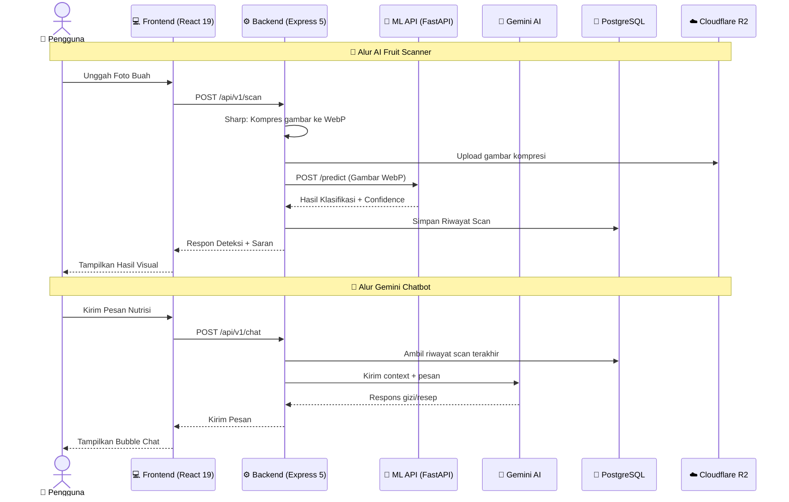
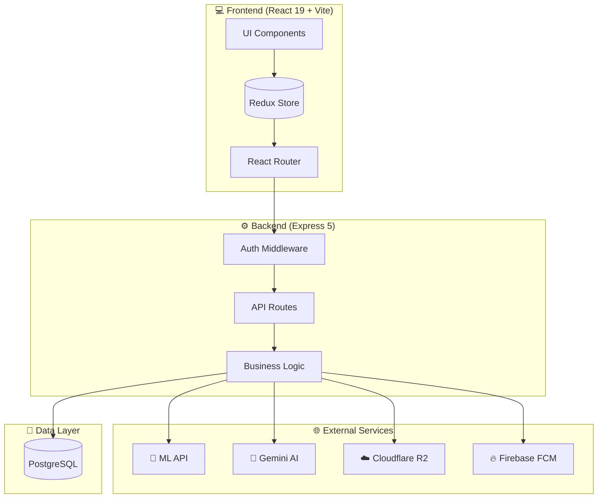

<!-- PROJECT BANNER -->
<p align="center">
  
</p>

<!-- PROJECT HEADER -->
<div align="center">
  <h1>🍏 Freshly — AI Fruit Freshness Detection</h1>
  <p>
    <b>Platform cerdas berbasis Computer Vision & Kecerdasan Buatan untuk klasifikasi kematangan buah secara instan.</b>
  </p>

  <p align="center">
    <a href="#-tentang-freshly">Tentang</a> •
    <a href="#-fitur-utama">Fitur</a> •
    <a href="#-arsitektur-sistem">Arsitektur</a> •
    <a href="#-spesifikasi-teknologi">Tech Stack</a> •
    <a href="#-panduan-instalasi">Instalasi</a> •
    <a href="#-lisensi">Lisensi</a>
  </p>

  <!-- BADGES -->
  <p align="center">
    
    
    
    
    
    
    
    
    
  </p>

  <p align="center">
    
    
    
    
  </p>
</div>

<br />

---

## 📖 Tentang Freshly

**Freshly** adalah solusi *all-in-one* modern berkinerja tinggi yang menggabungkan kecanggihan algoritma Deep Learning dan kemudahan penggunaan aplikasi web. Dirancang menggunakan arsitektur monorepo terpadu, platform ini membantu pengguna akhir maupun pemilik bisnis buah-buahan untuk menentukan kualitas kesegaran buah secara objektif dan mendapatkan saran gizi kontekstual secara langsung.

> [!NOTE]
> Freshly dibangun dengan arsitektur **monorepo** yang terintegrasi penuh: **Frontend** (React 19 + Vite + Tailwind v4), **Backend** (Express 5 + PostgreSQL), **Machine Learning API** (FastAPI + TensorFlow), dan **Cloud Infrastructure** (Vercel + Cloudflare R2 + Firebase).

---

## 🌟 Fitur Utama

<table>
<tr>
<td width="50%">

### 📷 AI Fruit Scanner
- Klasifikasi tingkat kematangan buah (*Matang*, *Belum Matang*, *Busuk*)
- **Confidence score** & saran kelayakan konsumsi instan
- Kompresi gambar pintar berbasis **WebP** via Sharp
- Penyimpanan aset di **Cloudflare R2** Object Storage

</td>
<td width="50%">

### 💬 Gemini AI Chatbot
- Asisten virtual nutrisi interaktif berbasis **Google Gemini**
- *Context-awareness* — memahami hasil scan buah terakhir
- Dukungan **Markdown rendering** & syntax highlighting
- Riwayat obrolan tersimpan di database

</td>
</tr>
<tr>
<td>

### 📚 Fruit Encyclopedia
- Katalog visual buah-buahan komprehensif
- Informasi kalori, vitamin, kandungan gizi lengkap
- Tips memilih buah manis secara tradisional
- Pencarian & filter berdasarkan kategori

</td>
<td>

### 👑 Admin Portal & CMS
- Manajemen akun pengguna & tinjauan testimonial
- Audit logs sistem untuk aktivitas operasional
- Editor WYSIWYG **TipTap** untuk artikel edukasi
- Dashboard statistik real-time

</td>
</tr>
</table>

---

## 🔄 Arsitektur Sistem

Diagram berikut menunjukkan alur komunikasi penuh antara Frontend, Backend, Model Machine Learning, dan layanan eksternal:



### 🏗️ High-Level Architecture



---

## 🛠️ Spesifikasi Teknologi

<table>
<tr>
<td width="50%">

### Frontend

| Teknologi | Versi | Peran |
| :--- | :--- | :--- |
| **React** | v19.2 | UI Library dengan React Compiler |
| **TypeScript** | v6.0 | Type safety & developer experience |
| **Vite** | v8.0 | Build tool & dev server ultra-cepat |
| **Tailwind CSS** | v4.2 | Utility-first CSS framework |
| **Redux Toolkit** | v2.11 | State management terpusat |
| **React Router** | v7.14 | Client-side routing |
| **TipTap** | v3.22 | WYSIWYG editor untuk artikel |
| **MUI** | v9.0 | Component library |
| **Zod** | v4.3 | Schema validation |
| **i18next** | v26.0 | Internationalization (ID/EN) |

</td>
<td width="50%">

### Backend

| Teknologi | Versi | Peran |
| :--- | :--- | :--- |
| **Node.js** | >= v18 | JavaScript runtime |
| **Express** | v5.2 | Web framework |
| **Sequelize** | v6.37 | ORM untuk PostgreSQL |
| **Sharp** | v0.34 | Kompresi gambar WebP |
| **Joi** | v18.1 | Input validation |
| **Gemini SDK** | v0.24 | AI chatbot integration |
| **AWS S3 SDK** | v3.1041 | Cloudflare R2 client |
| **Firebase Admin** | v13.8 | Push notifications |
| **Helmet** | v8.1 | Security headers |
| **Winston** | v3.19 | Logging framework |

</td>
</tr>
</table>

### ☁️ Cloud Infrastructure

| Layanan | Provider | Fungsi |
| :--- | :--- | :--- |
| **Hosting** |  | Deploy frontend & serverless backend |
| **Object Storage** |  | Penyimpanan gambar buah (CDN global) |
| **Database** |  | PostgreSQL managed database |
| **AI Service** |  | Chatbot nutrisi berbasis LLM |
| **ML Hosting** |  | FastAPI model serving |
| **Push Notification** |  | FCM notifikasi real-time |
| **Email** |  | SMTP email service |

---

## 🛡️ Keamanan Sistem

<table>
<tr>
<td width="50%">

- 🛡️ **Helmet Security Headers** — Proteksi HTTP headers (CSP tanpa `unsafe-inline`)
- 🚦 **Rate Limiting** — Mencegah brute-force (1000 req/5min global, 10 req/15min auth)
- 🤖 **Google reCAPTCHA v2** — Proteksi spam form
- 🔑 **JWT + Silent Refresh** — Otentikasi tanpa interupsi (dengan refresh queue)

</td>
<td width="50%">

- 🧹 **HTML Sanitizer** — Pencegahan XSS
- 🔒 **Client Key Handshake** — Validasi frontend-backend
- 📋 **Joi Schema Validation** — Input sanitization
- 📊 **Audit Logging** — Pelacakan aktivitas sistem
- 🚫 **Token Blacklist** — Refresh token di-revoke saat logout

</td>
</tr>
</table>

---

## 📁 Struktur Monorepo

```
capstone/
├── 📦 backend/                    # RESTful API Server (Express.js)
│   ├── api/                       # Vercel Serverless Entrypoints
│   ├── migrations/                # Database migration files
│   ├── postman/                   # API testing collections
│   ├── scripts/                   # Development utilities
│   └── src/
│       ├── config/                # DB, Firebase, JWT, AI configs
│       ├── controllers/           # HTTP request handlers
│       ├── middlewares/           # Security & auth middlewares
│       ├── models/                # Sequelize model definitions
│       ├── routes/                # API v1 route declarations
│       └── services/              # Business logic services
│
├── 💻 frontend/                   # Client SPA (React + Vite)
│   ├── public/                    # Static assets
│   └── src/
│       ├── api/                   # Axios interceptors
│       ├── assets/                # Images, logos, styles
│       ├── components/            # Reusable UI components
│       ├── hooks/                 # Custom React hooks
│       ├── layouts/               # Page layouts
│       ├── pages/                 # Route pages (24 halaman)
│       ├── redux/                 # Redux store & slices
│       ├── router/                # Route definitions
│       └── types/                 # TypeScript declarations
│
├── 📄 vercel.json                  # Vercel deployment config
├── 📄 package.json                 # Root workspace config
└── 📄 README.md                    # ← Anda sedang membaca ini
```

---

## 🚀 Panduan Instalasi

### Persyaratan Sistem

| Software | Versi Minimum | Verifikasi |
| :--- | :--- | :--- |
| **Node.js** | v18.x+ | `node --version` |
| **NPM** | v9.x+ | `npm --version` |
| **PostgreSQL** | v14+ | `psql --version` |

### 💻 Quick Start

```bash
# 1. Clone repository
git clone https://github.com/FRESHLY-CC26-PSU059/FRESHLY.git
cd FRESHLY/fullstack

# 2. Setup Backend
cd backend
cp .env.example .env        # Konfigurasi environment
npm install                  # Pasang dependensi
npm run migrate              # Jalankan migrasi DB
npm run seed:admin           # Buat akun admin default
npm run dev                  # Jalankan server (port 5000)

# 3. Setup Frontend (terminal baru)
cd FRESHLY/fullstack/frontend
cp .env.example .env        # Konfigurasi environment
npm install                  # Pasang dependensi
npm run dev                  # Jalankan dev server (port 5173)
```

Akses aplikasi: **[http://localhost:5173](http://localhost:5173)**

---

## ☁️ Deployment

### Environment Variables

> [!IMPORTANT]
> Salin variabel berikut ke konfigurasi **Vercel** atau file `.env` masing-masing service.

<details>
<summary><b>🔧 Backend Environment Variables</b></summary>

```env
# SERVER & CORS
NODE_ENV=production
PORT=5000
CORS_ORIGIN=https://freshly.yourdomain.com
FRONTEND_URL=https://freshly.yourdomain.com
CLIENT_KEY=your_frontend_api_handshake_key

# JWT SECURITY TOKENS
JWT_SECRET=your_jwt_secret_key
JWT_REFRESH_SECRET=your_jwt_refresh_secret_key
JWT_EXPIRES_IN=1d
JWT_REFRESH_EXPIRES_IN=30d

# SUPABASE / POSTGRES DATABASE
PG_HOST=your_supabase_pooler_host
PG_PORT=5432
PG_DATABASE=postgres
PG_USER=postgres
PG_PASSWORD=your_secure_password

# CLOUDFLARE R2 OBJECT STORAGE
R2_ACCOUNT_ID=your_cloudflare_r2_account_id
R2_BUCKET_NAME=your_r2_bucket_name
R2_ACCESS_KEY_ID=your_r2_access_key_id
R2_SECRET_ACCESS_KEY=your_r2_secret_access_key
R2_PUBLIC_URL=https://your_r2_public_url.r2.dev

# GOOGLE GEMINI AI
GEMINI_API_KEY=your_google_gemini_api_key

# MACHINE LEARNING API
ML_API_URL=https://your_ml_model_api_url.space
ML_API_TIMEOUT=30000
ML_API_MOCK=false

# GOOGLE RECAPTCHA v2
RECAPTCHA_SECRET_KEY=your_recaptcha_secret_key

# SMTP EMAIL SERVICE (Resend)
SMTP_HOST=smtp.resend.com
SMTP_PORT=465
SMTP_USER=resend
SMTP_PASS=your_resend_smtp_password
SMTP_FROM=noreply@yourdomain.com
```

</details>

<details>
<summary><b>🔧 Frontend Environment Variables</b></summary>

```env
# RESTful API Backend
VITE_API_URL=http://localhost:5000/api/v1

# Client Key Handshake
VITE_CLIENT_KEY=your_frontend_api_handshake_key_here

# Google reCAPTCHA v2 (Site Key)
VITE_RECAPTCHA_SITE_KEY=your_recaptcha_site_key_here

# Firebase Web App (FCM Push Notifications)
VITE_FIREBASE_API_KEY=your_firebase_web_api_key_here
VITE_FIREBASE_APP_ID=your_firebase_web_app_id_here
VITE_FIREBASE_AUTH_DOMAIN=your_firebase_project_id.firebaseapp.com
VITE_FIREBASE_MEASUREMENT_ID=your_firebase_measurement_id_here
VITE_FIREBASE_MESSAGING_SENDER_ID=your_firebase_messaging_sender_id_here
VITE_FIREBASE_PROJECT_ID=your_firebase_project_id_here
VITE_FIREBASE_STORAGE_BUCKET=your_firebase_project_id.firebasestorage.app
VITE_FIREBASE_VAPID_KEY=your_firebase_fcm_vapid_key_here
VITE_CONTACT_EMAIL=support@freshly.app,info@freshly.app # Email kontak (pisahkan dengan koma jika lebih dari satu)
```

</details>

---

## 🧪 Testing

```bash
# Backend
cd backend
npm run test              # Unit tests (Jest)
npm run test:coverage     # Coverage report
npm run test:api          # API integration (Newman/Postman)

# Frontend
cd frontend
npm run test:unit         # Unit & component tests (Vitest)
npm run test:coverage     # Coverage report
npm run test:e2e:ui       # E2E tests (Playwright)
```

---

## 📄 Lisensi

Hak Cipta dilindungi di bawah **Apache License 2.0** — Bebas digunakan, dimodifikasi, dan didistribusikan untuk kepentingan akademis, pembelajaran, dan riset mandiri.

Lihat file [LICENSE](../LICENSE) untuk informasi lebih lanjut.

---

<!-- BACK TO TOP -->
<p align="center">
  <a href="#-freshly--ai-fruit-freshness-detection"><b>⬆️ Kembali ke Atas</b></a>
</p>

<!-- LINKS & BADGES REFERENCE -->
[React-badge]: https://img.shields.io/badge/React_19-20232A?style=for-the-badge&logo=react&logoColor=61DAFB
[React-url]: https://react.dev/
[TS-badge]: https://img.shields.io/badge/TypeScript-007ACC?style=for-the-badge&logo=typescript&logoColor=white
[TS-url]: https://www.typescriptlang.org/
[Tailwind-badge]: https://img.shields.io/badge/Tailwind_CSS_v4-38B2AC?style=for-the-badge&logo=tailwind-css&logoColor=white
[Tailwind-url]: https://tailwindcss.com/
[Express-badge]: https://img.shields.io/badge/Express.js-000000?style=for-the-badge&logo=express&logoColor=white
[Express-url]: https://expressjs.com/
[Postgres-badge]: https://img.shields.io/badge/PostgreSQL-4169E1?style=for-the-badge&logo=postgresql&logoColor=white
[Postgres-url]: https://www.postgresql.org/
[Sequelize-badge]: https://img.shields.io/badge/Sequelize_ORM-52B0E7?style=for-the-badge&logo=sequelize&logoColor=white
[Sequelize-url]: https://sequelize.org/
[Gemini-badge]: https://img.shields.io/badge/Gemini_AI-10A981?style=for-the-badge&logo=google&logoColor=white
[Gemini-url]: https://deepmind.google/technologies/gemini/
[Vercel-badge]: https://img.shields.io/badge/Vercel-000000?style=for-the-badge&logo=vercel&logoColor=white
[Vercel-url]: https://vercel.com/
[Node-badge]: https://img.shields.io/badge/Node.js-339933?style=for-the-badge&logo=nodedotjs&logoColor=white
[Node-url]: https://nodejs.org/
