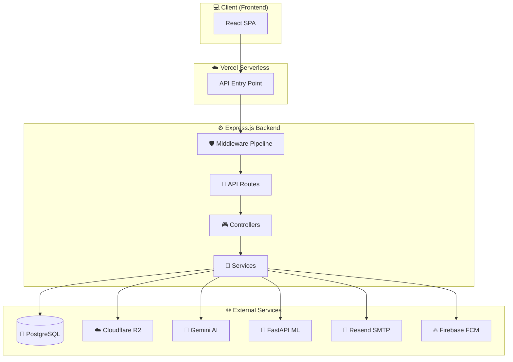
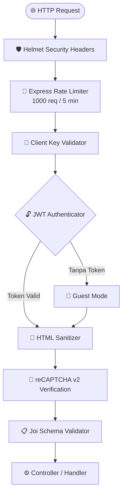

<div align="center">
  <h1>⚙️ Freshly Backend API</h1>
  <p>
    <b>RESTful API backend untuk platform Freshly — menangani pemrosesan data, autentikasi keamanan, integrasi AI, dan manipulasi media.</b>
  </p>

  <p align="center">
    <a href="#-deskripsi-proyek">Deskripsi</a> •
    <a href="#-endpoint-api">API Endpoints</a> •
    <a href="#-arsitektur-backend">Arsitektur</a> •
    <a href="#-keamanan-middleware">Keamanan</a> •
    <a href="#-testing">Testing</a>
  </p>

  <p align="center">
    
    
    
    
    
    
    
  </p>
</div>

<br />

---

## 📖 Deskripsi Proyek

Layanan backend Freshly dibangun di atas platform **Node.js** menggunakan kerangka kerja **Express.js v5**. Layanan ini bertanggung jawab atas seluruh pemrosesan logika berat aplikasi:

- 🖼️ **Pemrosesan gambar** — Kompresi WebP via Sharp + upload ke Cloudflare R2
- 🧠 **Integrasi ML** — Komunikasi dengan FastAPI model serving
- 🤖 **AI Chatbot** — Asisten nutrisi berbasis Google Gemini
- 🔐 **Keamanan** — JWT + Silent Refresh + Rate Limiting + reCAPTCHA
- 📊 **Audit Logging** — Pelacakan aktivitas operasional

---

## 🏗️ Arsitektur Backend



---

## 📡 Endpoint API

### 🔐 Authentication

| Method | Endpoint | Deskripsi | Auth |
| :--- | :--- | :--- | :--- |
| `POST` | `/api/v1/auth/register` | Registrasi akun baru | ❌ |
| `POST` | `/api/v1/auth/login` | Masuk ke akun | ❌ |
| `POST` | `/api/v1/auth/logout` | Keluar dari akun | ✅ |
| `POST` | `/api/v1/auth/refresh` | Refresh token akses | ❌ |
| `POST` | `/api/v1/auth/forgot-password` | Kirim email reset password | ❌ |
| `POST` | `/api/v1/auth/verify-otp` | Verifikasi OTP email | ❌ |
| `POST` | `/api/v1/auth/reset-password` | Reset password baru | ❌ |

### 👤 Users

| Method | Endpoint | Deskripsi | Auth |
| :--- | :--- | :--- | :--- |
| `GET` | `/api/v1/users` | Ambil semua pengguna | ✅ Admin |
| `GET` | `/api/v1/users/:id` | Ambil detail pengguna | ✅ |
| `PUT` | `/api/v1/users/:id` | Perbarui profil pengguna | ✅ |
| `DELETE` | `/api/v1/users/:id` | Hapus pengguna | ✅ Admin |

### 🍎 Scans

| Method | Endpoint | Deskripsi | Auth |
| :--- | :--- | :--- | :--- |
| `POST` | `/api/v1/scans` | Unggah & klasifikasi buah | ✅ |
| `GET` | `/api/v1/scans` | Ambil riwayat scan | ✅ |
| `GET` | `/api/v1/scans/:id` | Ambil detail scan | ✅ |

### 💬 Chat & Chatbot

| Method | Endpoint | Deskripsi | Auth |
| :--- | :--- | :--- | :--- |
| `POST` | `/api/v1/chat` | Kirim pesan ke chatbot | ✅ |
| `GET` | `/api/v1/chat` | Ambil riwayat obrolan | ✅ |
| `POST` | `/api/v1/chatbot` | Interaksi chatbot nutrisi | ✅ |

### 📚 Content Management

| Method | Endpoint | Deskripsi | Auth |
| :--- | :--- | :--- | :--- |
| `GET` | `/api/v1/articles` | Ambil semua artikel | ❌ |
| `POST` | `/api/v1/articles` | Buat artikel baru | ✅ Admin |
| `PUT` | `/api/v1/articles/:id` | Perbarui artikel | ✅ Admin |
| `DELETE` | `/api/v1/articles/:id` | Hapus artikel | ✅ Admin |
| `GET` | `/api/v1/knowledges` | Ambil knowledge base | ❌ |
| `POST` | `/api/v1/knowledges` | Tambah knowledge | ✅ Admin |

### 🛡️ Admin & System

| Method | Endpoint | Deskripsi | Auth |
| :--- | :--- | :--- | :--- |
| `GET` | `/api/v1/stats` | Dashboard statistik | ✅ Admin |
| `GET` | `/api/v1/audit-logs` | Riwayat audit logs | ✅ Admin |
| `GET` | `/api/v1/roles` | Daftar role | ✅ Admin |
| `GET` | `/api/v1/notifications` | Notifikasi pengguna | ✅ |
| `GET` | `/api/v1/testimonials` | Daftar testimonial | ✅ Admin |
| `GET` | `/api/v1/newsletter` | Daftar subscriber | ✅ Admin |
| `GET` | `/api/v1/status` | Status API server | ❌ |

---

## 🛡️ Keamanan Middleware

Setiap request HTTP melewati **7 layer keamanan** sebelum diproses controller:



| Layer | Teknologi | Fungsi |
| :--- | :--- | :--- |
| 1 | **Helmet** | Proteksi HTTP security headers (CSP tanpa `unsafe-inline`) |
| 2 | **Rate Limiter** | Mencegah brute-force & DDoS (1000 req/5min global) |
| 3 | **Client Key** | Validasi handshake frontend-backend |
| 4 | **JWT Auth** | Otorisasi berbasis token (blacklist saat logout) |
| 5 | **HTML Sanitizer** | Pencegahan XSS injection |
| 6 | **reCAPTCHA** | Verifikasi bot & spam |
| 7 | **Joi Validator** | Validasi input schema |

---

## 🛠️ Spesifikasi Teknologi

<table>
<tr>
<td width="50%">

### Core

| Pustaka | Versi | Peran |
| :--- | :--- | :--- |
| **Node.js** | >= v18 | Runtime JavaScript |
| **Express** | v5.2 | Web framework |
| **Sequelize** | v6.37 | ORM PostgreSQL |
| **Sharp** | v0.34 | Kompresi gambar WebP |
| **Joi** | v18.1 | Input validation |

</td>
<td width="50%">

### Integrasi

| Pustaka | Versi | Peran |
| :--- | :--- | :--- |
| **Gemini SDK** | v0.24 | AI chatbot |
| **AWS S3 SDK** | v3.1041 | Cloudflare R2 |
| **Firebase Admin** | v13.8 | Push notifications |
| **Helmet** | v8.1 | Security headers |
| **Winston** | v3.19 | Logging |

</td>
</tr>
</table>

---

## 📁 Struktur Folder

```
backend/
├── 📦 api/                      # Vercel Serverless Entrypoints
├── 🗄️ migrations/               # Database migration files
├── 🧪 postman/                  # API testing collections (Newman)
├── 🔧 scripts/                  # Development utilities
├── 📂 src/
│   ├── ⚙️ config/               # DB, Firebase, JWT, AI configs
│   ├── 🎮 controllers/          # HTTP request handlers
│   ├── 🛡️ middlewares/          # Security & auth middlewares
│   ├── 📊 models/               # Sequelize model definitions
│   ├── 📡 routes/               # API v1 route declarations
│   ├── 🧩 services/             # Business logic services
│   └── 🚀 app.js               # Express initialization
├── 🧪 tests/                    # Unit & integration tests
└── 📄 vercel.json               # Vercel serverless config
```

### 📊 Database Models (12 Tabel)

| Model | Tabel | Deskripsi |
| :--- | :--- | :--- |
| **User** | `users` | Data pengguna & profil |
| **Role** | `roles` | Role akses (admin/user) |
| **Token** | `tokens` | Refresh tokens & OTP |
| **Scan** | `scans` | Riwayat pemindaian buah |
| **Knowledge** | `knowledges` | Database pengetahuan buah |
| **Article** | `articles` | Artikel edukasi |
| **Conversation** | `conversations` | Sesi obrolan chatbot |
| **Message** | `messages` | Pesan dalam obrolan |
| **Feedback** | `feedbacks` | Umpan balik pengguna |
| **Testimonial** | `testimonials` | Testimonial publik |
| **Subscriber** | `subscribers` | Newsletter subscribers |
| **AuditLog** | `audit_logs` | Log aktivitas sistem |
| **Notification** | `notifications` | Notifikasi pengguna |

---

## 🛑 Error Codes

Setiap respon error mengembalikan format JSON terstandarisasi:

| HTTP Status | Error Code | Deskripsi |
| :--- | :--- | :--- |
| `400 Bad Request` | `VALIDATION_ERROR` | Input tidak lolos validasi Joi |
| `401 Unauthorized` | `UNAUTHORIZED` | Token JWT kosong/kedaluwarsa |
| `401 Unauthorized` | `INVALID_CREDENTIALS` | Email/sandi salah |
| `403 Forbidden` | `FORBIDDEN` | Role tidak memiliki akses |
| `403 Forbidden` | `INVALID_CLIENT_KEY` | Client key salah |
| `429 Too Many Requests` | `RATE_LIMIT_EXCEEDED` | Melebihi batas request |
| `500 Internal Server Error` | `INTERNAL_ERROR` | Kesalahan server internal |

### 📤 Response Format

```json
{
  "success": false,
  "error": {
    "code": "VALIDATION_ERROR",
    "message": "Email format is invalid"
  }
}
```

---

## 🚀 Instalasi

> [!IMPORTANT]
> Pastikan `.env` sudah dikonfigurasi dari `.env.example` sebelum menjalankan migrasi.

```bash
# 1. Install dependencies
npm install

# 2. Jalankan migrasi database
npm run migrate

# 3. Seed admin default
npm run seed:admin

# 4. Jalankan development server
npm run dev
```

### 📜 Available Scripts

| Script | Deskripsi |
| :--- | :--- |
| `npm run dev` | Jalankan server development (Nodemon) |
| `npm run start` | Jalankan server production |
| `npm run migrate` | Jalankan database migrations |
| `npm run migrate:reset` | Reset & jalankan ulang migrations |
| `npm run seed:admin` | Seed role & admin default |
| `npm run db:fresh` | Reset + migrate + seed |
| `npm run test` | Jalankan unit tests (Jest) |
| `npm run test:coverage` | Jalankan tests dengan coverage |
| `npm run test:api` | Jalankan API tests (Newman) |
| `npm run lint` | Cek kode dengan ESLint |
| `npm run format` | Format kode dengan Prettier |

---

## 🧪 Testing

```bash
# Unit tests (Jest)
npm run test

# Coverage report
npm run test:coverage

# API integration tests (Newman + Postman)
npm run test:api
```

---

<!-- BACK TO TOP -->
<p align="center">
  <a href="#️-freshly-backend-api"><b>⬆️ Kembali ke Atas</b></a>
</p>
