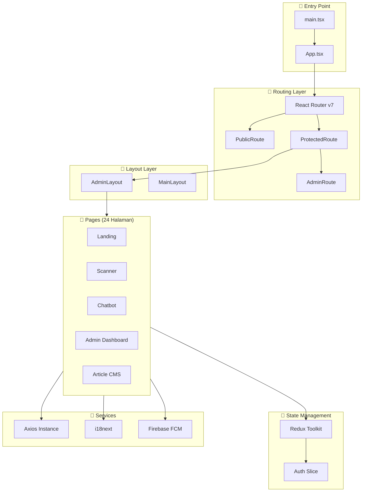
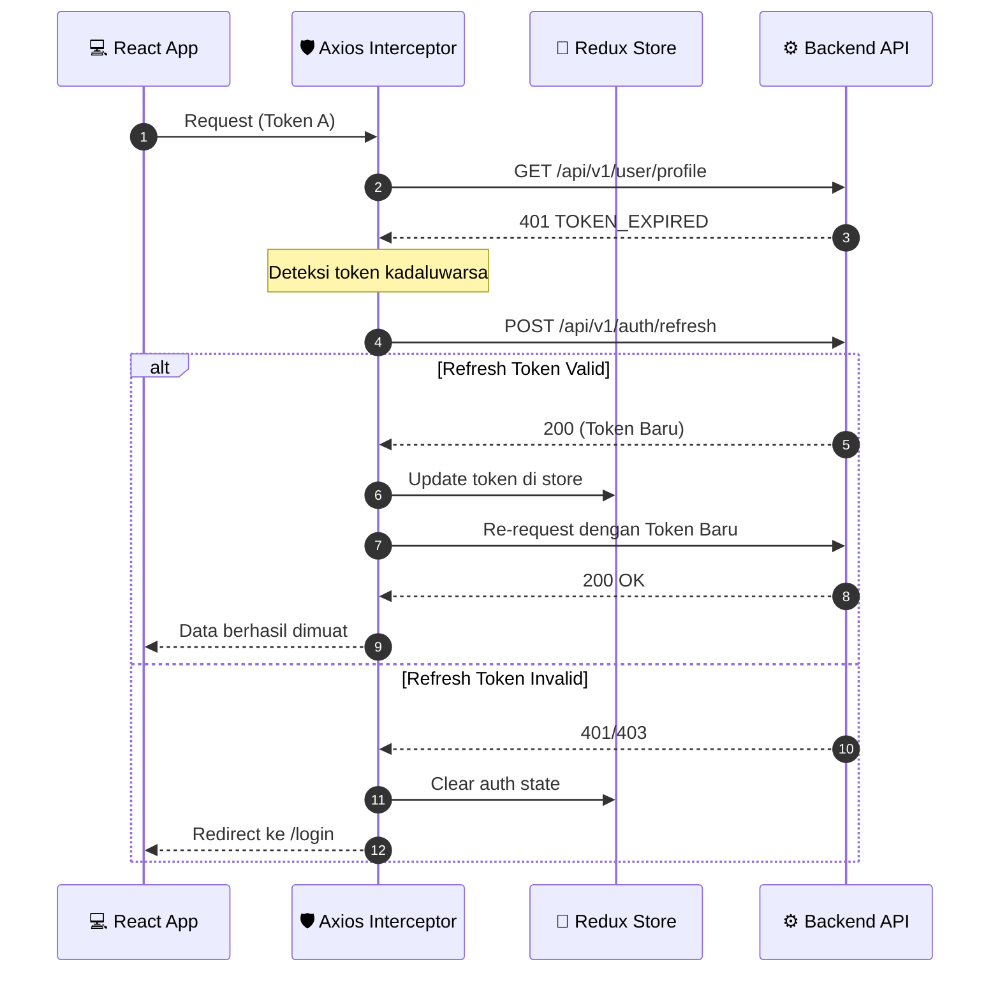

<div align="center">
  <h1>💻 Freshly Frontend Web Application</h1>
  <p>
    <b>Aplikasi Web Single Page Application (SPA) berbasis React 19, Vite, dan Tailwind CSS untuk platform Freshly.</b>
  </p>

  <p align="center">
    <a href="#-deskripsi-proyek">Deskripsi</a> •
    <a href="#-halaman-aplikasi">Halaman</a> •
    <a href="#-arsitektur-aplikasi">Arsitektur</a> •
    <a href="#-state-management">State</a> •
    <a href="#-testing">Testing</a>
  </p>

  <p align="center">
    
    
    
    
    
    
    
    
  </p>
</div>

<br />

---

## 📖 Deskripsi Proyek

Aplikasi frontend ini dirancang khusus untuk menyajikan antarmuka pengguna yang responsif (*mobile-first*), interaksi waktu-nyata (*real-time*), serta transisi antarhalaman yang mulus demi memberikan pengalaman terbaik bagi pengguna dalam memindai buah dengan AI, berkonsultasi dengan asisten nutrisi, dan mengelola database melalui portal admin.

### ✨ Highlights

- 🎨 **Desain Modern** — Tema emerald green dengan dark/light mode otomatis
- 🌐 **Multilingual** — Bahasa Indonesia & Inggris (i18next)
- 📱 **Mobile-First** — Responsive di semua ukuran layar
- ⚡ **Code Splitting** — Lazy loading semua halaman via React.lazy
- 🔐 **Silent Refresh** — Token refresh tanpa interupsi pengguna

---

## 🗂️ Halaman Aplikasi

### 🔓 Public Routes

| Halaman | Path | Deskripsi |
| :--- | :--- | :--- |
| **Landing** | `/` | Halaman utama dengan hero section & CTA |
| **Ensiklopedia** | `/ensiklopedia` | Katalog buah publik |
| **Login** | `/login` | Form masuk akun |
| **Register** | `/register` | Form registrasi akun baru |
| **Verify Email** | `/verify-email` | Verifikasi email registrasi |
| **Forgot Password** | `/forgot-password` | Form lupa password |
| **Verify OTP** | `/verify-otp` | Verifikasi OTP reset password |
| **Reset Password** | `/reset-password` | Form reset password baru |

### 👤 User Routes (Protected)

| Halaman | Path | Deskripsi |
| :--- | :--- | :--- |
| **Dashboard** | `/user/dashboard` | Dashboard pengguna |
| **Scans** | `/user/scans` | Riwayat pemindaian buah |
| **Conversations** | `/user/conversations` | Riwayat obrolan chatbot |
| **Profile** | `/user/profile` | Profil pengguna |
| **Settings** | `/user/settings` | Pengaturan akun |

### 👑 Admin Routes (Admin Only)

| Halaman | Path | Deskripsi |
| :--- | :--- | :--- |
| **Dashboard** | `/admin/dashboard` | Dashboard admin dengan statistik |
| **Users** | `/admin/users` | Manajemen pengguna |
| **Roles** | `/admin/roles` | Manajemen role & akses |
| **Scans** | `/admin/scans` | Riwayat scan semua pengguna |
| **Articles** | `/admin/articles` | CMS artikel edukasi (TipTap) |
| **Knowledge** | `/admin/knowledge` | Knowledge base buah |
| **Conversations** | `/admin/conversations` | Monitor obrolan chatbot |
| **Testimonials** | `/admin/testimonials` | Tinjauan testimonial |
| **Notifications** | `/admin/notifications` | Manajemen notifikasi |
| **Newsletter** | `/admin/newsletter` | Daftar subscriber |
| **Audit Logs** | `/admin/audit-logs` | Log aktivitas sistem |
| **Profile** | `/admin/profile` | Profil admin |
| **Settings** | `/admin/settings` | Pengaturan sistem |

---

## 🏗️ Arsitektur Aplikasi



---

## 🔄 State Management

### 🔑 Axios Interceptor & Silent Refresh Flow



### 🗂️ Redux Store Structure

```typescript
// Hanya 1 slice: Auth
interface AuthState {
  user: {
    id: string;
    name: string;
    email: string;
    role: 'admin' | 'user';
  } | null;
  token: string | null;
  refreshToken: string | null;
  isAuthenticated: boolean;
  loading: boolean;
}
```

---

## 🛠️ Spesifikasi Teknologi

<table>
<tr>
<td width="50%">

### Core

| Teknologi | Versi | Peran |
| :--- | :--- | :--- |
| **React** | v19.2 | UI Library + React Compiler |
| **TypeScript** | v6.0 | Type safety |
| **Vite** | v8.0 | Build tool & dev server |
| **Tailwind CSS** | v4.2 | Utility-first CSS |

</td>
<td width="50%">

### Libraries

| Teknologi | Versi | Peran |
| :--- | :--- | :--- |
| **Redux Toolkit** | v2.11 | State management |
| **React Router** | v7.14 | Client-side routing |
| **MUI** | v9.0 | Component library |
| **TipTap** | v3.22 | WYSIWYG editor |
| **Zod** | v4.3 | Schema validation |
| **i18next** | v26.0 | Internationalization |
| **Firebase** | v12.12 | Push notifications |

</td>
</tr>
</table>

### 🧪 Testing Stack

| Tool | Versi | Fungsi |
| :--- | :--- | :--- |
| **Vitest** | v4.1 | Unit & component testing |
| **Playwright** | v1.60 | End-to-end testing |
| **Testing Library** | v16.3 | React component testing |
| **jsdom** | v29.1 | DOM environment untuk tests |

---

## 📁 Struktur Folder

```
frontend/
├── 📦 public/                   # Static assets (favicon, manifest)
└── 📂 src/
    ├── 📡 api/                  # Axios instance & interceptors
    ├── 🎨 assets/               # Images, logos, styles
    │   ├── freshly_banner.png   # Banner proyek
    │   ├── Logo1.jpeg           # Logo aplikasi
    │   ├── hero.png             # Hero section image
    │   └── images/fruits/       # Gambar buah (mangga, pisang, dll.)
    ├── 🧩 components/           # Reusable UI components
    │   ├── ui/                  # Base UI components
    │   ├── layout/              # Layout components (Sidebar, Header)
    │   └── chat/                # Chatbot components
    ├── 🪝 hooks/                # Custom React hooks
    ├── 🖼️ layouts/              # Page layouts (Admin, Dashboard)
    ├── 📄 pages/                # Route pages (24 halaman)
    ├── 🔄 redux/                # Redux store & slices
    ├── 🛣️ router/               # Route definitions & guards
    ├── 📝 types/                # TypeScript declarations
    ├── 🌐 i18n/                 # Internationalization config
    ├── 📊 services/             # Service utilities
    └── 🚀 main.tsx              # Application entry point
```

---

## ⚙️ Environment Variables

Buat berkas `.env` di folder `frontend/`:

```env
# API Backend
VITE_API_URL=http://localhost:5000/api/v1
VITE_CLIENT_KEY=your_frontend_api_handshake_key_here

# Google reCAPTCHA v2
VITE_RECAPTCHA_SITE_KEY=your_recaptcha_site_key_here

# Firebase (FCM Push Notifications)
VITE_FIREBASE_API_KEY=your_firebase_web_api_key_here
VITE_FIREBASE_APP_ID=your_firebase_web_app_id_here
VITE_FIREBASE_AUTH_DOMAIN=your_firebase_project_id.firebaseapp.com
VITE_FIREBASE_MEASUREMENT_ID=your_firebase_measurement_id_here
VITE_FIREBASE_MESSAGING_SENDER_ID=your_firebase_messaging_sender_id_here
VITE_FIREBASE_PROJECT_ID=your_firebase_project_id_here
VITE_FIREBASE_STORAGE_BUCKET=your_firebase_project_id.firebasestorage.app
VITE_FIREBASE_VAPID_KEY=your_firebase_fcm_vapid_key_here

# Contact (mendukung beberapa email sekaligus dengan pemisah koma)
VITE_CONTACT_EMAIL=support@freshly.app,info@freshly.app
```

---

## 📜 Available Scripts

| Script | Deskripsi |
| :--- | :--- |
| `npm run dev` | Jalankan Vite dev server |
| `npm run build` | Build untuk produksi |
| `npm run preview` | Preview build produksi |
| `npm run test:unit` | Unit tests (Vitest) |
| `npm run test:coverage` | Tests dengan coverage |
| `npm run test:e2e` | E2E tests (Playwright) |
| `npm run test:e2e:ui` | E2E tests dengan UI |
| `npm run lint` | Cek kode dengan ESLint |

---

## 🧪 Testing

```bash
# Unit & Component tests
npm run test:unit

# Coverage report
npm run test:coverage

# E2E tests (Playwright)
npm run test:e2e:ui

# E2E tests untuk production
npm run test:prod
```

---

<!-- BACK TO TOP -->
<p align="center">
  <a href="#-freshly-frontend-web-application"><b>⬆️ Kembali ke Atas</b></a>
</p>
